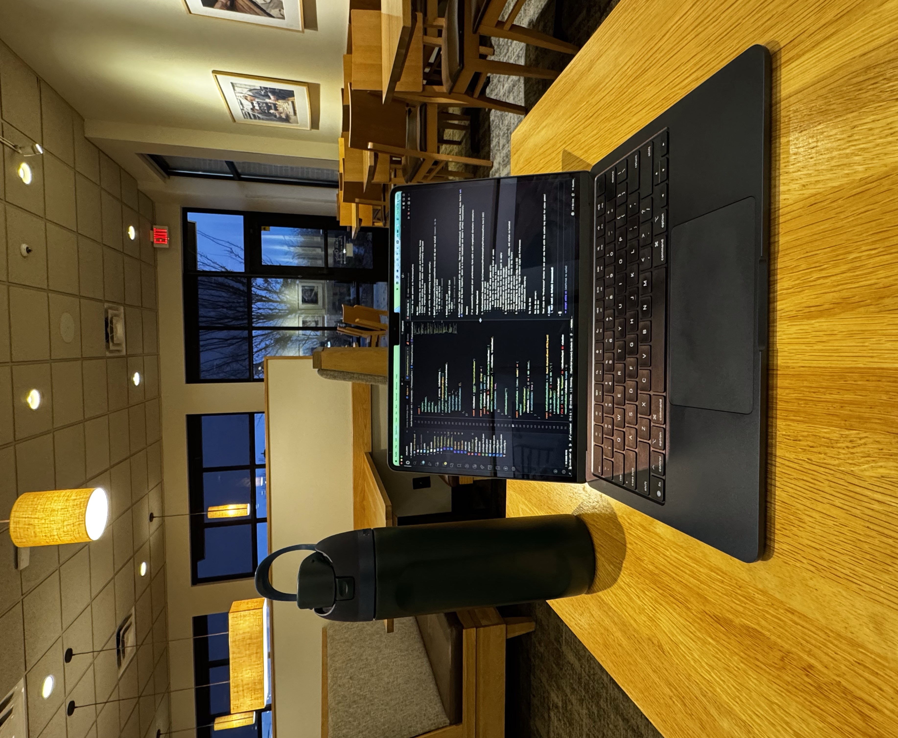

As I sit in a Panera bread going through a Claude Code CLI tutorial, I start to get excited about the potential these AI tools can achieve. It's as if a new power has been unlocked and it's waiting for us to bring life to projects undreamed of. As I ponder more into the idea of how AI is transforming the software development industry, I can't say if this is a good thing or a bad thing...we can all agree that there is a mandate in the industry to use AI as much as possible in our workflows. At the end of the day, then, who will be in control?

I think it depends...on how you use AI. With the emergence of "vibe coding", we have romanticized the idea of letting AI do all of the work for us, while we sit back and watch Netflix while scrolling through TikTok. And it all can be done in a matter of minutes. No more searching deep into StackOverflow posts, best practices seem to be out of the door. There's no need to even attempt to learn new patterns and architectures. Why should I if AI can take care of everything for me?

Most would say that AI could "eventually" replace developers. Although I cannot predict the future, this could be a possibility. But not in our lifetime anyways. Even if everything can be automated, there's still a need for human intervention to wire it all up. Now, I am not saying this to calm my anxiety in regards to when the AI overlords take over our jobs. It's just the current state of the AI boom. It's still early in its tooling but advancing at a rapid pace.

How then, would I recommend usage of AI in our workflows? I would not adopt "vibe coding" where I essentially let AI do all of my work blindly and brute force a solution...it only leads to more bugs and more chaos. We have to remember that it is WE who are in control. WE guide AI to create solutions for us, not the other way around. We have to keep reminding ourselves that AI is just a tool, it's a powerful swiss knife which can help in multiple areas of software development. Always checking what it's doing, correct it and slap its hand when it's doing something wrong (they won't retaliate, will they?).

I see it as a coding assistant. Which can help me navigate a complex codebase. I can ask it questions as I keep exploring, and learn new things by simply asking follow up questions. It actually never gets tired of my silly dumb questions, and doesn't judge me. I simply use it to further increase my knowledge and way of doing things. Learn new documentation, explain esoteric topics. To help me breakdown complex logic into understandable functions.

But it can make apps so there's no need for developers anymore. Sure, I agree with that statement but to a certain extent. Most of the apps these AI models are able to build would be considered minimal. More of a prototype. I don't think it's able to build large scale enterprise apps that integrate with multiple services. I can already see where it can go astray. I only think AI will make software development more accessible than before. Anyone can now actually start using AI to build fully functional apps without having any prior knowledge of programming. I think it frees us of having to do the tedious and grunt work and enables us to focus more on creative solutions. I do see myself spending more time learning patterns and looking at problems at a high level, since I know AI can take care of the boring tasks.

AI definitely has transformed the software development industry (and currently is), for the good or the bad, it largely depends on your usage - as with anything in life. I still don't think it will replace us anytime soon. It's far from perfect, it's still a baby learning from its mistakes. In the meantime, I will keep eating my sandwich while AI is fixing bugs for me. What a time to be alive.
